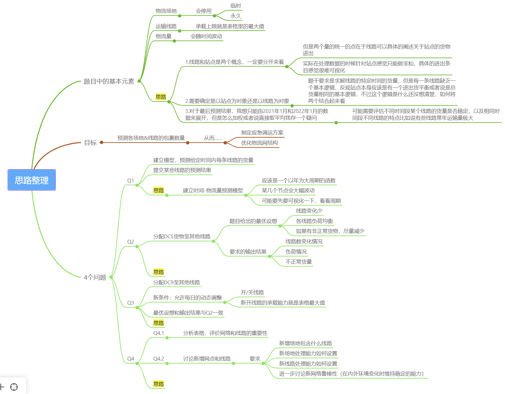

# 

## 思路整理

## 
- 题目中的基本元素
    - 物流场地
        - 会停用
            - 临时
            - 永久
    - 运输线路
        - 承载上限就是表格里的最大值
    - 物流量
        - 会随时间波动
    - ==思路==
        - 1.线路和站点是两个概念，一定要分开来看
            - 但是两个量的统一的点在于线路可以具体的阐述关于站点的货物进出
            - 实际在处理数据的时候针对站点感觉只能做求和，具体的进出条目感觉很难可视化
        - 2.需要确定是以站点为对象还是以线路为对象
            - 题干要求是求解线路的特定时间的货量，但是每一条线路缺乏一个基本逻辑，反观站点本身应该是有一个进出货平衡或者说是总货量相同的基本逻辑，不过这个逻辑是什么还没想清楚，如何将两个结合起来看
        - 3.对于最后预测结果，我想只能由2021年1月和2022年1月的数据来展开，但是怎么加权或者说直接取平均我存一个疑问
            - 可能需要评估不同时间段某个线路的货量是否稳定，以及相同时间段不同线路的特点比如说有些线路常年运输量极大
- 目标
    - 预测各场地&线路的包裹数量
        - 从而……
            - 制定应急调运方案
            - 优化物流网结构
- 4个问题
    - Q1
        - 建立模型，预测给定时间内每条线路的货量
        - 提交某些线路的预测结果
        - ==思路==
            - 建立时间-物流量预测模型
                - 应该是一个以年为大周期的函数
                - 某几个节点会大幅波动
                - 可能要先要可视化一下，看看周期
    - Q2
        - 分配DC5货物至其他线路
            - 题目给出的最优设想
                - 线路变化少
                - 各线路负荷均衡
                - 如果有非正常货物，尽量减少
            - 要求的输出结果
                - 线路数变化情况
                - 负荷情况
                - 不正常货量
        - ==思路==
    - Q3
        - 分配DC9至其他线路
        - 新条件：允许每日的动态调整
            - 开/关线路
            - 新开线路的承载能力就是表格最大值
        - 最优设想和输出结果与Q2一致
        - ==思路==
    - Q4
        - Q4.1
            - 分析表格，评价网络和线路的重要性
        - Q4.2
            - 讨论新增网点和线路
                - 要求
                    - 新增场地包含什么线路
                    - 新场地处理能力如何设置
                    - 新线路处理能力如何设置
                    - 进一步讨论新网络鲁棒性（在内外环境变化时维持稳定的能力）
        - ==思路==
## AI给出的可能思路

**问题1：线路货量预测模型**
- **思路**：
  1. **数据预处理**：处理缺失值，标记促销、节假日作为特征。
  2. **时间序列分析**：分解趋势、季节性和周期性，识别促销影响。
  3. **模型选择**：
     - **Prophet**：处理节假日和促销事件。
     - **LSTM/GRU**：捕捉长期依赖和非线性关系。
     - **SARIMA**：适合有明显季节性的数据。
  4. **验证与调优**：使用滚动窗口验证，调整超参数。
  5. **预测结果**：输出三条指定线路的日预测值。

**问题2：DC5关停后的货量分配**
- **思路**：
  1. **网络流模型**：将进出DC5的货量重新分配到其他线路。
  2. **约束条件**：
     - 处理能力（场地进入量 ≤ 历史最大）。
     - 运输能力（线路货量 ≤ 历史最大）。
  3. **目标函数**：
     - 最小化受影响线路数。
     - 最小化未流转量（线性规划松弛）。
     - 均衡负载（如最小化负载方差）。
  4. **求解方法**：混合整数线性规划（MILP）或多阶段优化。

**问题3：DC9关停及动态调整网络**
- **思路**：
  1. **动态网络调整**：每日允许新增/关闭线路。
  2. **新增线路约束**：运输能力上限为现有线路最大值。
  3. **变量扩展**：引入二进制变量表示每日线路开关状态。
  4. **多周期优化**：按天分解问题，结合时间序列预测。
  5. **输出结果**：每日线路增减情况及分流效果。

**问题4：网络评价与新增规划**
- **思路**：
  1. **重要性评价**：
     - **中心性指标**：度、介数、接近度。
     - **流量占比**：货量或处理量占比。
     - **失效模拟**：移除节点/边后网络效率变化。
  2. **新增策略**：
     - **缓解瓶颈**：在负载高的节点间新增线路。
     - **提升连通性**：填补网络结构漏洞。
  3. **鲁棒性分析**：
     - **冗余设计**：确保关键路径有替代线路。
     - **随机模拟**：测试货量波动下的稳定性。

---

**总结**：  
- **预测问题**需结合时间序列特征与外部事件；  
- **分流问题**需构建网络优化模型，权衡多目标；  
- **动态调整**需引入时间维度与网络结构变量；  
- **网络评价**依赖图论指标与场景模拟。